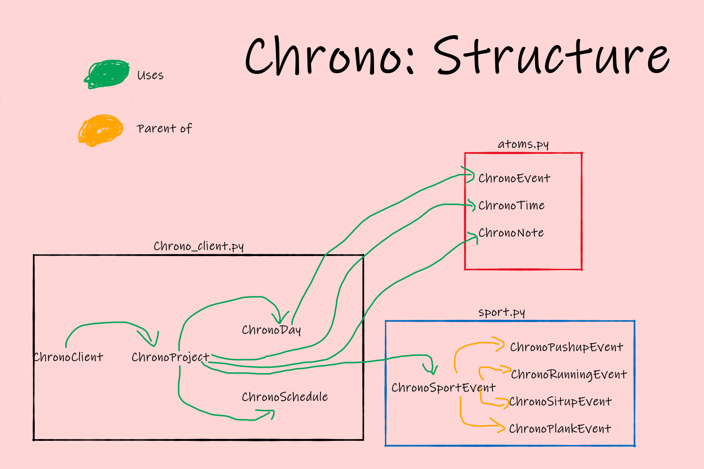

# Chrono guide

Welcome to the Chrono guide! You will learn how to setup your very own Chrono and how to use it in no time! While for some it may seem scary at first, I hope most will feel right at home quite quickly.

## Setting up chrono

Besides the actual chrono program, you will need **2** or **3** files. All of them should be saved in the "data" folder.

### settings.json

"settings.json" should look like this:

```javascript
{
    "color_scheme":{
        "default":"black",
        "math":"magenta"
    },
    "pdfpath":"YOUR_PATH",
    "oura":false,
    "oura_key":"",
    "code":"111",
    "alias":{}
}
```

Remember to change the value of "pdfpath" to the path of your Adobe Acrobat reader if you want to use the "show" command. If you want to use oura to import your sleep data add your Personal Access Token as the "oura_key" value and set oura to true.

### project.json

"project.json" should look like this

```javascript
{
    "todo": [], 
    "name": "MSSH-project",
    "path": "project",
    "days": {},
    "sevents": []
}
```

### schedule.json

You can add a "schedule.json" file, which should look like this

```javascript
[
    [
        [
            {"start": "12:00", "end": "13:00", "what":"Lunch", "tags":["other"]},
            {"start": "18:00", "end": "19:00", "what":"Dinner", "tags":["other"]}
        ],
        [  
            {"start": "12:00", "end": "13:00", "what":"Lunch", "tags":["other"]},
            {"start": "18:00", "end": "19:00", "what":"Dinner", "tags":["other"]}
        ],
        [
            {"start": "12:00", "end": "13:00", "what":"Lunch", "tags":["other"]},
            {"start": "18:00", "end": "19:00", "what":"Dinner", "tags":["other"]}
        ],
        [
            {"start": "12:00", "end": "13:00", "what":"Lunch", "tags":["other"]},
            {"start": "18:00", "end": "19:00", "what":"Dinner", "tags":["other"]}
        ],
        [
            {"start": "12:00", "end": "13:00", "what":"Lunch", "tags":["other"]},
            {"start": "18:00", "end": "19:00", "what":"Dinner", "tags":["other"]}
        ],
        [
            {"start": "12:00", "end": "13:00", "what":"Lunch", "tags":["other"]},
            {"start": "18:00", "end": "19:00", "what":"Dinner", "tags":["other"]}
        ],
        [
            {"start": "12:00", "end": "13:00", "what":"Lunch", "tags":["other"]},
            {"start": "18:00", "end": "19:00", "what":"Dinner", "tags":["other"]}
        ]
    ]
]
```

But could also look like

```javascript
[
    [
        [],
        [],
        [],
        [],
        [],
        [],
        []
    ]
]
```

Your Schedule can by n-weekly, and once you generate a day in chrono it will be populated according to your schedule.

## Basic commands

### Syntax

Chrono commands always look like this:

```
command argument_1 argument_2 ...
```

If one of your arguments needs to contain a space, you will have to enclose it with double quotes:

```
command "This is a test" argument_2
```

The most common use cases are: "mkEvent" and "note".

Examples:

```
mkEvent "Chrono: Documentation" chrono,programming,md 15:00 16:00 
```

```
note "This contains spaces"
```

Note that you do not need to use double quotes at all when using the "note" command. See the documentation of note for more information.


### setr

Chrono always works within a reference scope, which you can change with:

```
setr [reference]
```

The default reference is "base", but your reference should be of the format "YYYY-MM-DD", to tell chrono which day you are manipulating. If you set you reference to a day which hasn't been generated yet, chrono will generate a day for you respecting your "schedule.json" file.

A useful shortcut:

```
setr today
```

sets the reference to the current date.

### mkEvent

"mkEvent" is one of the most important commands. It takes a **4-5** arguments (which are separated by spaces):

1. "what" : Describe what the ChronoEvent represents (will be displayed if you export your data to pdf)
2. "tags" : List of tags separated by ",". Those tags will later be used to categorize the event while you analyze your data. Each event should have all the tags, by which you want to analyze your time usage later.
3. "start" : The time at which your event starts, should be of the format "HH:MM".
4. "stop" : The time at which your event ends, should be of the format "HH:MM".
5. "force"="1" : If force $=1$ chrono will delete all overlapping events and add the current event to the referenced day. If force equals $0$ the event will not be added to the referenced day.

Tip: If you find yourself repeating the same input, just with different start / stop value you can use an alias.

Example:

```
mkEvent Chrono chrono,programming 15:00 16:00 
```

### help

"help" takes **1** argument, which should be the name of a command or an alias. Help will give you the signature of the command as well as a short description of the functionality if the argument is a command. If the argument is an alias chrono will print the alias itself. You can gather even more information by calling help on the commands used by the alias.

Example:

```
help mkEvent
```

### delEvent

delEvent takes **2** arguments:

1. "start" : The time at which your Event starts, should be of the format "HH:MM".
2. "stop" : The time at which your Event ends, should be of the format "HH:MM".

If the day identified by the current reference contains an event with exactly those start- / stop- times it will be deleted.

Example:

```
delEvent 15:00 16:00 
```

### changeEtime

changeEtime takes **2** arguments:

1. "start" : The time at which your Event starts, should be of the format "HH:MM".
2. "stop" : The time at which your Event ends, should be of the format "HH:MM".
3. "nstart" : The time at which your Event should start, should be of the format "HH:MM".
4. "nstop" : The time at which your Event should end, should be of the format "HH:MM".

If the day identified by the current reference contains an event with exactly those start- / stop- times it will change those to nstart and nstop.

Example:

```
changeEtime 15:00 16:00 15:15 16:00
```

### save

save saves the current state of the project to the same file the project was read from. Should be used after each major addition.

### note

note takes **1-n** arguments which will be combined to **1** argument by concatenating the n arguments split up by spaces.

1. text: The note to be saved.
2. *texts: the other n-1 arguments.

Examples:

Both of these commands do the exact same thing:

```
note "My note contains spaces"
```

```
note My note contains spaces
```

### notes

notes takes **0** arguments. The command just prints every note to the command line (FIFO).

### deln

deln takes **1-n** arguments which will be combined to **1** argument by concatenating the n arguments split up by spaces. deln deletes all notes with the exact same argument.

1. text: the text.
2. *texts: the other n-1 arguments.

Examples:

Both of these commands do the exact same thing:

```
deln "My note contains spaces"
```

```
deln My note contains spaces
```

### mkTime

A ChronoTime should describe an instantaneous event (like a deadline). 

mkTime takes **3** or **4** arguments and saves them to a ChronoTime.

1. what : Describe what this ChronoTime is about.
2. tags : Tags describing this ChronoTime.
3. start : The time.
4. date: The date on which the ChronoTime should be. If no date is given, it will be inferred to be the current reference.

Keep in mind that the day on which the ChronoTime happens needs to be generated before you can create a ChronoTime for the day.

Examples:

```
mkTime "Super important deadline" job,deadline,programming 17:59
```

```
mkTime "Super important deadline" job,deadline,programming 17:59 2020-12-13
```

### times

times takes **1** argument and prints the ChronoTimes for the next $days days:

1. days : The amount of days considered (starting from the current day). Should be at least 0. If no argument is given days=1 will be inferred. 

Example:

```
times
```

```
times 7
```

## Commands: Analysis

### plot

plot takes **1-3** argument and plots the hours of each individual tag, the sum of all the selected tags as well as the week day average of the sum over the specified time frame.

1. tags : tags which should be plotted.
2. start_date : Valued "start" if no different value is given. If you supply a value it should be either start or an ISO representation of the start date (e.g. 2020-05-22). 
3. end_date : Valued "stop" if no different value is given. If you supply a value it should be either stop or an ISO representation of the end date (e.g. 2020-05-22). 

Examples:

```
plot uni,blog
```

```
plot uni,blog start 2020-08-01
```

### plotw

plotw takes **2-4** argument and plots the hours of each individual tag, the sum of all the selected tags as well as the week day average of the sum over the specified time frame.

1. tags : tags which should be plotted.
2. k : number of days to be plotted. If no k is given k=7 will be inferred.
3. start_date : Valued "start" if no different value is given. If you supply a value it should be either start or an ISO representation of the start date (e.g. 2020-05-22). 
4. end_date : Valued "stop" if no different value is given. If you supply a value it should be either stop or an ISO representation of the end date (e.g. 2020-05-22). 
Examples:

```
plot uni,blog
```
```
plot uni,blog 14
```

### heatmap

heatmap takes **2-4** arguments and displays a heatmap of the given tag over the specified time frame.

1. tag: tag to be analysed.
2. yt: maximum number of labels describing the timeframes on any day. yt=10-15 recommended.
3. start_date : Valued "start" if no different value is given. If you supply a value it should be either start or an ISO representation of the start date (e.g. 2020-05-22). 
4. end_date : Valued "stop" if no different value is given. If you supply a value it should be either stop or an ISO representation of the end date (e.g. 2020-05-22). 

Example:

```
heatmap blog 10
```

### stats

stats takes **1** argument and prints the overall average as well as the weekly average for every tag.

1. tags: List of tags for which those stats should be plotted.

Example:

```
stats blog,chrono
```

## Advanced settings

### Color scheme

The "color_scheme" option allows you to customize the output of show. Each event will be color coded by the first of its tags appearing in your color scheme. The color scheme is a dictionary / hashmap where both the key and the value are strings. Your color scheme needs to have a key value pair for the key "default", which will be applied to all events not hit by any other key. Multiple keys can point to the same color and the color should be called the same as in vanilla [$\LaTeX$](https://www.overleaf.com/learn/latex/Using_colours_in_LaTeX#Reference_guide).

Example (my current setup):
```javascript
"color_scheme":{
        "default":"black",
        "leben":"black",
        "relax":"black",
        "mathe":"red",
        "uni":"red",
        "creative":"green",
        "programming":"blue",
        "korean":"magenta"
}
```

### Aliases

If you find yourself writing the same command over and over again only changing the one or two arguments each time, you might want to use an alias. An alias uses partial function application to only require those inputs regularly changing. 

Each alias uses the following structure:

Write out the command as you would type it in chrono, but replace each argument that should be given to your alias
with "\$1","\$2" up to some finite "\$n". Be aware that those arguments start at \$1 and not \$0! If you want to reference all the arguments not referenced explicitly, you can use $N which will insert all of those arguments

A real life example: While coding and documenting chrono, I wanted to create chrono events with the same name and tag quite frequently, so I added the following alias:

```javascript
"alias":{
        "mkc": "mkEvent Chrono chrono,programming $1 $2",
        "mkcb": "mkEvent \"Chrono: Blog\" chrono,programming,blog $1 $2"
        "custom_plot": "plot $1 $N"
}
```

Notice how you can use escaped double quotes to account for spaces in arguments.

Aliases can also include multiple commands:

```javascript
"alias":{
    "startday":"setr today |> today",
    "create_deadline":""
}
```

Use "|>" to separate commands. This is heavily inspired by f#'s "forward pipe operator".


## Oura

If you use an [oura ring](https://ouraring.com/) to track your sleep you can import your sleep data using "ouras". Call "help ouras" for more information regarding the command. Before you can use this command you will have to setup your connection to oura. Go to your settings file ("data/settings.json") and set oura to true. Next create a [personal access token](https://support.ouraring.com/hc/en-us/articles/360051560614-Using-Oura-s-API) and set the "oura_key" value accordingly.

## Structure 

